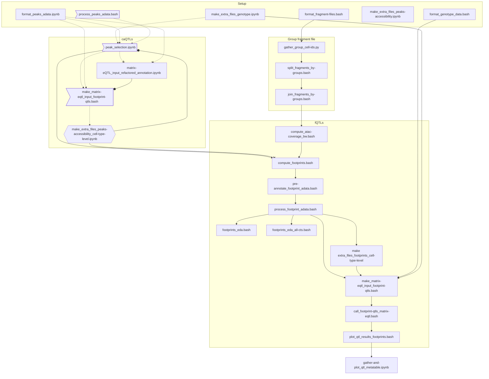

## Workflow



**Legend**
- Squared blocks: scripts
- Rounded corner square blocks: function files
- Hexagonal blocks: non-existent files
- Left indented squared blocks: unfinished file
- Dotted line: path not used yet
- X-ended arrows: Not intended downstream (e.g. temporary file)
- o-ended arrows: Newer/updated version of the file


## Environment setup

### R

For reproducibility, `renv.lock` and `DESCRIPTION` files were provided for project-level R-package dependencies setup using `renv`.

Execute the following script to setup the `renv` environment:

```
renv::init(bioconductor = TRUE)
# renv will ask which dependencies to use -> `explicit` from DESCRIPTION file

renv::restore()
```

[renv's](https://rstudio.github.io/renv/index.html) documentation and articles are very useful for setup and package installation debugging.

For setup on the DKFZ odcf cluster (dated: 2024-11-27) follow additional configuration steps in `.setup-odcf-env.bash` BEFORE installing packages with `renv` as above. This scripot also creates the file `load-odcf-env.bash` to load specific modules. Source when working with the project.
